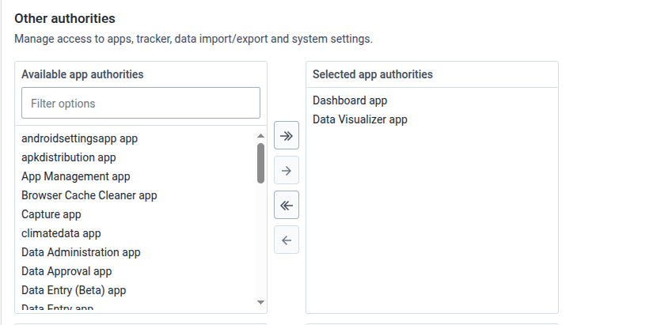
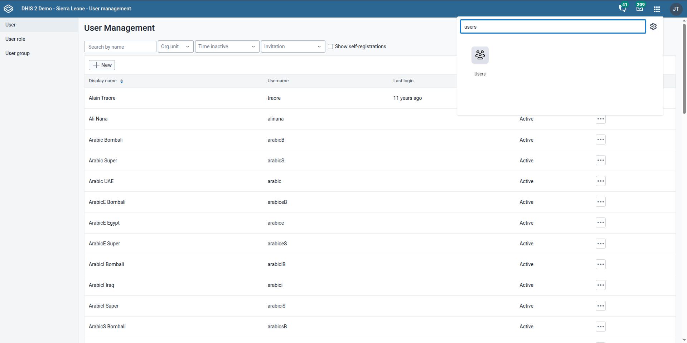
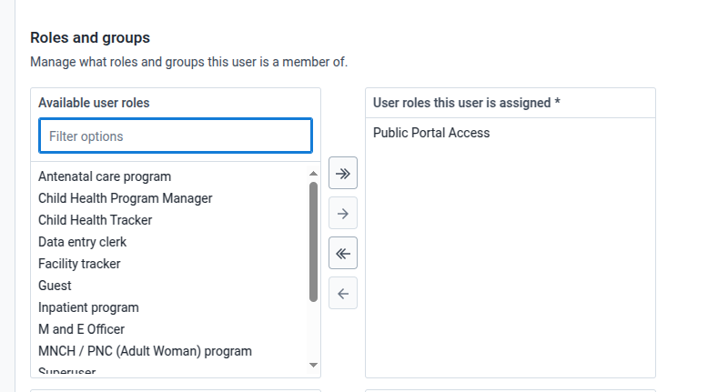
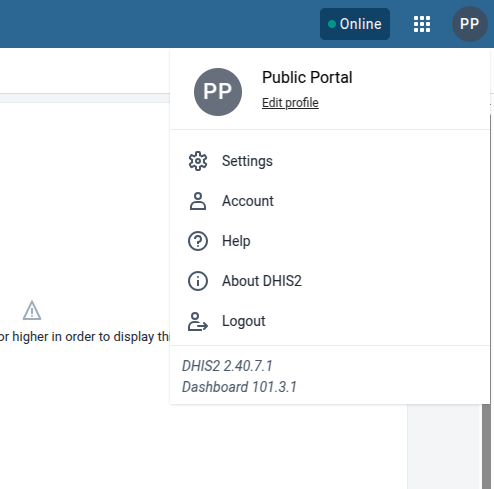
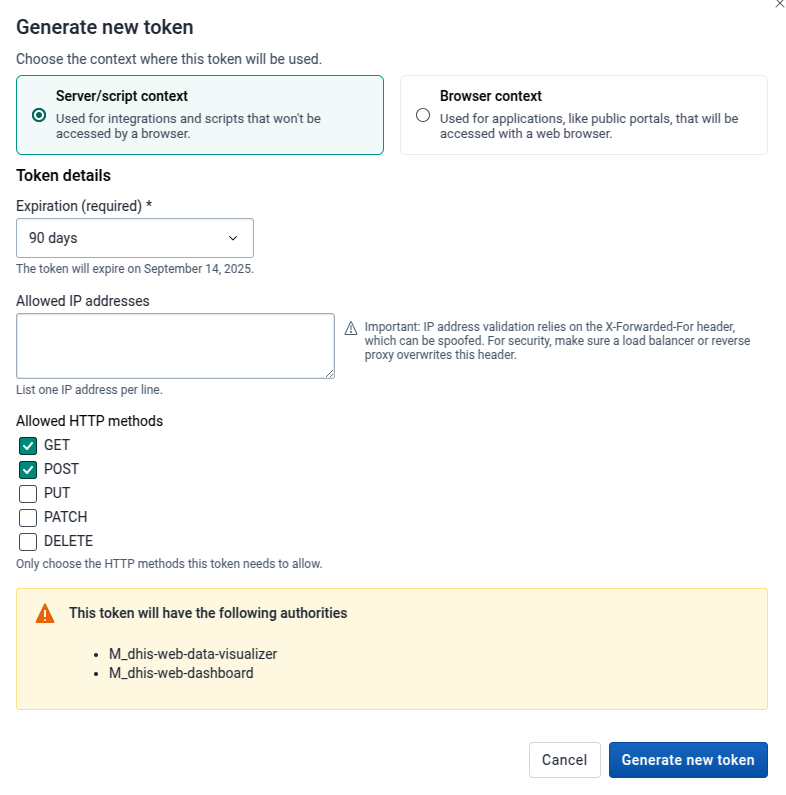

# DHIS2 Access Settings

This guide walks you through configuring DHIS2 to securely expose public charts/maps using a **Personal Access Token (PAT)**. The token will be embedded in the **FlexiPortal** to fetch DHIS2 visualizations.

## User Definition Preparation

### Objective

Define a lightweight user account whose sole purpose is to:
- Fetch public DHIS2 visualizations
- Be used in automated scripts or websites (via token)

### Security Note

This account must:
- Have **read-only permissions**
- Must not be assigned to **any metadata or any other authorities/access** except for app authorities which are necessary to view public visualizations.
- Only use **GET** and **POST** HTTP methods via PAT

> 💡 This setup allows secure embedding of DHIS2 visualizations (charts/maps) on the FlexiPortal.

---

## Creating a User Role

### Objective

Create a user role with the minimal set of authorities needed to view and load public DHIS2 visualizations via the DHIS2 API.

### Steps

1. Log in as a superuser (`admin`).
2. Go to:  
   **Apps -> Users -> User role**
3. Click **"New"**.

 

#### Fill in:

- **Name**: The name for this user role. 
  - `Public Portal Access`
- **Description**: This is a short, clear description of what this role is for. 
  - `Allows public access to dashboards and visualizations`

#### Authorities to assign:
- **App authorities**: Manage access to apps, allowing the user to view public visualizations. Select the following:
  - `App: Dashboard`
  - `App: Data visualizer app`

> ⚠️ Do **NOT** assign any metadata authorities, tracker, import/export or system authorities.

4. Scroll all the way down and Click **Create role**.

---

## Creating a User

### Objective

Create a user, used for token-based public access. This user is not for human login — it will mainly be used by the FlexiPortal to fetch DHIS2 visualizations.

### Steps

1. Go to:  
   **Apps ->  Users -> User**
2. Click **"New"**.

#### Fill in:

- **Username**: This is the username for the user
    - `public.portal`
- **First name**: This is the first name of the user
    - `Public`
- **Surname**: This is the surname of the user 
    - `Portal`
- **Password**: Set a strong, secure password.
- **Organisation units access**: Assign the top-level OU (e.g., `National`) or where the visualizations are scoped.
  
- **User role**: Select the previously configured user role. In this case our user role was named `Public Portal Access`
  

3. Scroll all the way down and Click **Create user**.

---

## Generating a Public Access Token (PAT)

### Objective

Generate a **GET-only Personal Access Token (PAT)** for the user `public.portal` to use in the FlexiPortal.

### Steps
1. Log in as `public.portal`
2. Click the **avatar icon** (top-right) → **"Edit profile"**
3. Go to the **"Personal access tokens"** tab
4. Click **"Generate new token"**

#### Fill in:

- **Token context**: The context where this token will be used, for this case select `Server/script context`
- **Expiry**: Set to a reasonable duration, you can set the lifetime of this token to be how ever long you want (e.g., 90 days)
- **Allowed HTTP methods**: These are the HTTP methods that this token will need, for this case choose ✅ `GET` and `POST` only.

5. Click **Generate new token** and then click on **Copy to clipboard** immediately (shown only once!)

> You'll only be shown your token once. 
Make sure to copy your personal access token at this time. You won't be able to see it again. Store this token securely (in environment variables) — it's your key to public access.

