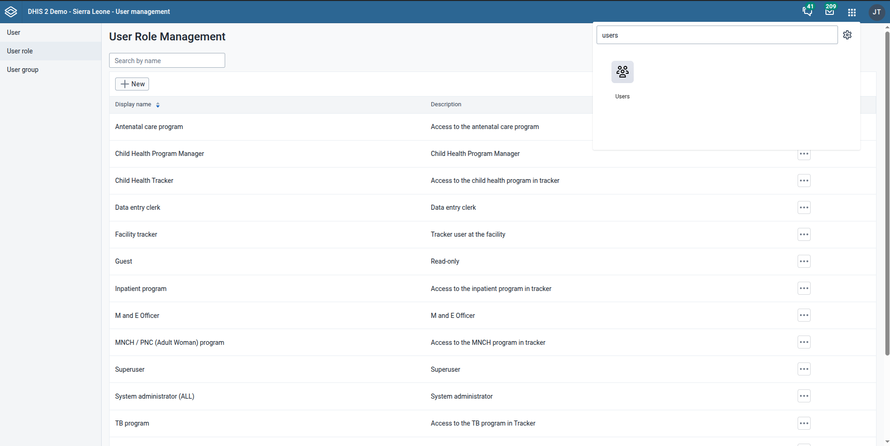
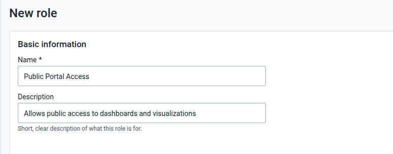
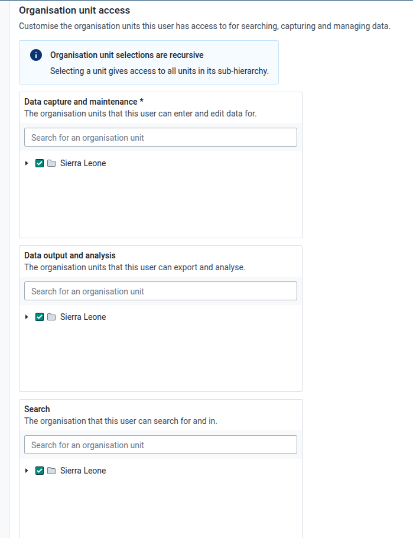
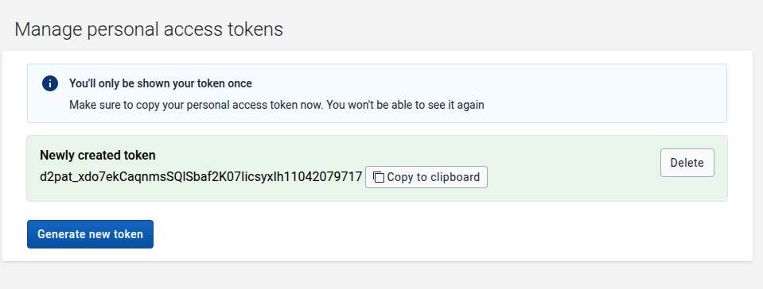

# DHIS2 Access Settings

While FlexiPortal empowers you to have a secure public display of your data, it is important to adhere to DHIS2 security
guidelines and make sure the user that will be used to authenticate the FlexiPortal only has the necessary authority.

To add another layer of security,
FlexiPortal only uses DHIS2's [**Personal Access Token
**](https://docs.dhis2.org/en/use/user-guides/dhis-core-version-242/working-with-your-account/personal-access-tokens.html?h=personal+access+token)
to access the DHIS2

This guide walks you
through creating a low-access DHIS2 user to securely expose public data and a **Personal Access Token(PAT)**.
The token will be set in the **FlexiPortal** to authenticate it to your DHIS2 instance.

## User Preparation

This section will explain how to define a lightweight user account whose sole purpose is to authenticate the FlexiPortal

### Creating a User Role

Create a user role with the minimal set of authorities needed to view public DHIS2 visualizations and other resources
via the DHIS2 API.

#### Steps

1. Log in as a superuser (`admin`).
2. Go to:  
   **Apps -> Users -> User role**
3. Click **"New"**.

##### Fill in:

- **Name**: The name for this user role.
    - `Public Portal Access`
- **Description**: This is a short, clear description of what this role is for.
    - `Allows public access to dashboards and visualizations`

##### Authorities to assign:

- **App authorities**: Manage access to apps, allowing the user to view public visualizations. Select the following:
    - `App: Dashboard`
    - `App: Data visualizer app`

> ⚠️ Do **NOT** assign any metadata authorities, tracker, import/export or system authorities.

4. Scroll all the way down and Click **Create role**.

### Creating a User

Create a user, used for token-based public access. This user is not for human login — it will mainly be used by the
FlexiPortal to fetch DHIS2 visualizations.

#### Steps

1. Go to:  
   **Apps ->  Users -> User**
2. Click **"New"**.

##### Fill in:

- **Username**: This is the username for the user
    - `public.portal`
- **First name**: This is the first name of the user
    - `Public`
- **Surname**: This is the surname of the user
    - `Portal`
- **Password**: Set a strong, secure password.
- **Organisation units access**: Assign the top-level OU (e.g., `National`) or where the visualizations are scoped.
  
- **User role**: Select the previously configured user role. In this case our user role was named `Public Portal Access`
  

3. Scroll all the way down and Click **Create user**.

## Generating a Public Access Token (PAT)

You need to generate a **GET-only Personal Access Token (PAT)** for the user `public.portal` to use in the FlexiPortal.

### Steps

1. Log in as `public.portal`
2. Click the **avatar icon** (top-right) → **"Edit profile"**
3. Go to the **"Personal access tokens"** tab
4. Click **"Generate new token"**
   

#### Fill in:

- **Token context**: The context where this token will be used, for this case select `Server/script context`
- **Expiry**: Set to a reasonable duration, you can set the lifetime of this token to be how ever long you want (e.g.,
  90 days)
- **Allowed HTTP methods**: These are the HTTP methods that this token will need, for this case choose ✅ `GET` only. If
  you want to use the feedback form module present in the FlexiPortal, you will need to also select `POST` method as
  well.

5. Click **Generate new token** and then click on **Copy to clipboard** immediately (shown only once!)

> You'll only be shown your token once.
> Make sure to copy your personal access token at this time. You won't be able to see it again. Store this token
> securely (in environment variables) — it's your key to public access.

You can then use your `PAT` to set up your FlexiPortal 
